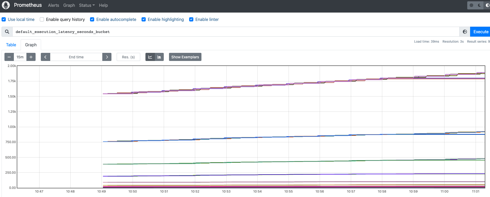

# 模块十作业

## 更新代码并打包上传

* `http_server.go`增加了延时和metrics处理API
```
docker build -t simdiak/httpserver .
docker push simdiak/httpserver:latest
```

## 更新了部署配置和prometheus服务发现

* m8.yaml

## 安装loki

* 下载
```
helm repo add grafana https://grafana.github.io/helm-charts
helm fetch grafana/loki-stack --untar
```
* loki-stack/values.yaml
```
grafana:
  enabled: true
  sidecar:
    datasources:
      enabled: true
      maxLines: 1000
  image:
    tag: 8.3.5

prometheus:
  enabled: true
  isDefault: false
  alertmanager:
    persistentVolume:
      enabled: false
  server:
    persistentVolume:
      enabled: false
```
* loki-stack/charts/prometheus/values.yaml
```
extraScrapeConfigs: |
  - job_name: custom-endpoints
    kubernetes_sd_configs:
    - role: endpoints
    relabel_configs:
    - source_labels: [__meta_kubernetes_service_annotation_prometheus_io_scrape]
      action: keep
      regex: true
    - source_labels: [__meta_kubernetes_service_annotation_prometheus_io_scheme]
      action: replace
      target_label: __scheme__
      regex: (https?)
    - source_labels: [__meta_kubernetes_service_annotation_prometheus_io_path]
      action: replace
      target_label: __metrics_path__
      regex: (.+)
    - source_labels: [__address__, __meta_kubernetes_service_annotation_prometheus_io_port]
      action: replace
      target_label: __address__
      regex: ([^:]+)(?::\d+)?;(\d+)
      replacement: $1:$2
    - action: labelmap
      regex: __meta_kubernetes_service_label_(.+)
    - source_labels: [__meta_kubernetes_namespace]
      action: replace
      target_label: kubernetes_namespace
    - source_labels: [__meta_kubernetes_service_name]
      action: replace
      target_label: kubernetes_name
    - source_labels: [__meta_kubernetes_pod_name]
      action: replace
      target_label: kubernetes_pod_name
```
* 安装
```
helm install loki loki-stack \
    --create-namespace \
    --namespace loki-stack
```

## 打开NodePort从prometheus查看

```
# kubectl edit svc -n loki-stack loki-prometheus-server
service/loki-prometheus-server edited
# kubectl get svc -n loki-stack
NAME                            TYPE        CLUSTER-IP      EXTERNAL-IP   PORT(S)        AGE
loki                            ClusterIP   10.233.32.220   <none>        3100/TCP       9m29s
loki-grafana                    ClusterIP   10.233.9.146    <none>        80/TCP         9m29s
loki-headless                   ClusterIP   None            <none>        3100/TCP       9m29s
loki-kube-state-metrics         ClusterIP   10.233.11.99    <none>        8080/TCP       9m29s
loki-prometheus-alertmanager    ClusterIP   10.233.12.38    <none>        80/TCP         9m29s
loki-prometheus-node-exporter   ClusterIP   None            <none>        9100/TCP       9m29s
loki-prometheus-pushgateway     ClusterIP   10.233.46.237   <none>        9091/TCP       9m29s
loki-prometheus-server          NodePort    10.233.48.33    <none>        80:32688/TCP   9m29s
```


## 小结

* 其实这个`custom-endpoints`不用加的，因为`kubernetes-service-endpoints`已经包含了它，所以在targets会有重复
* 如果是手动添加RBAC，则需要`ClusterRole/ServiceAccount/ClusterRoleBinding`设置才能使用，见`prometheus-rbac.yaml`

